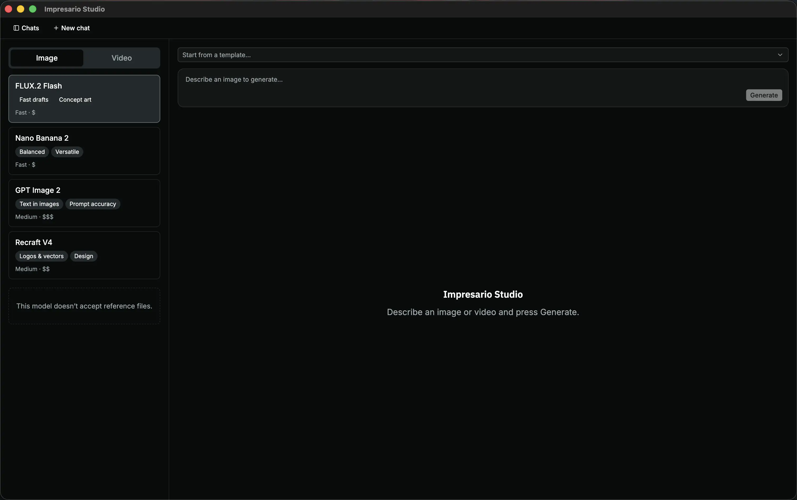
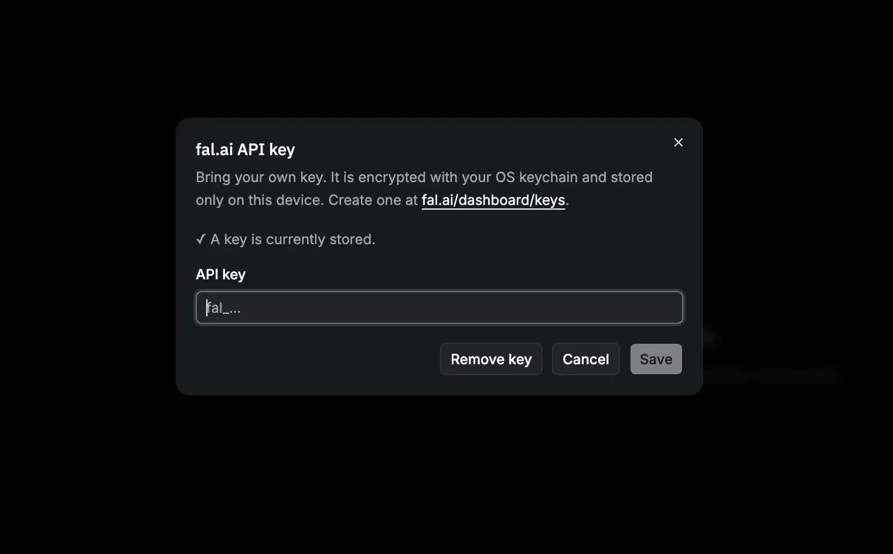

# Impresario Studio

**Impresario Studio is a desktop app for creating images (and video) with AI.**
It feels like a chat: you describe what you want, press a button, and the app
generates it for you. You can refine your idea over several messages, keep
different projects in separate conversations, and revisit everything you've made
later — all from your own computer.

Your work stays on your device. The app only talks to the AI service when you
ask it to generate something, and you use your own account to do so (see
[Before you start](#before-you-start)).



## What you can do

- **Generate images and video from a description.** Type what you want to see
  and the app creates it. Switch between **Image** and **Video** at the top of
  the model list.
- **Have a conversation.** Keep refining in follow-up messages — ask for
  changes, variations, or a different style.
- **Organize your work.** Each idea lives in its own conversation, which you can
  rename or delete from the **Chats** sidebar.
- **Choose a model.** Pick from the model list on the left — each shows what it's
  good at along with its speed and rough cost.
- **Use reference images.** Attach your own images to guide a generation (for
  models that support it).
- **Save templates.** Store prompts you use often and start from them with one
  click.
- **View full-size.** Click any result to open it large.

## Before you start

Impresario Studio uses [fal.ai](https://fal.ai) to generate images and video,
and you bring your own key — that means you sign up with fal.ai and the app uses
your account. To get set up:

1. Create a free account at [fal.ai](https://fal.ai).
2. Copy an API key from <https://fal.ai/dashboard/keys>.
3. Open the app, click **Settings (⚙)**, and paste your key.

Your key is encrypted with your operating system's keychain and stored only on
this device — it's never shared with anyone but fal.ai.



## How to use it

1. **Start a conversation** — the app opens ready for a new one.
2. **Describe what you want** in the text box at the bottom (for example,
   "a watercolor fox sitting in a snowy forest").
3. *(Optional)* Pick a **model**, attach a **reference image**, or start from a
   **template**.
4. **Press Generate** and wait a few moments for your image to appear.
5. **Keep going** — send another message to refine the result, or start a new
   conversation in the sidebar for a different idea.
6. **Click an image** to view it full-size.

<!-- Screenshot: a refined result after a few follow-up messages -->
<!--  -->

---

The rest of this document is for developers who want to run or modify the app.


## Getting started

```bash
pnpm install      # also rebuilds better-sqlite3 for Electron's ABI (postinstall)
pnpm dev          # run in development with HMR
```

On first launch, open **Settings (⚙)** and paste a fal.ai API key from
<https://fal.ai/dashboard/keys>. Then type a prompt and press **Generate**.

### Scripts

| Command                              | Description                         |
| ------------------------------------ | ----------------------------------- |
| `pnpm dev`                           | Run the app in development with HMR |
| `pnpm build`                         | Typecheck + build all three bundles |
| `pnpm start`                         | Preview the production build        |
| `pnpm typecheck`                     | Typecheck main/preload and renderer |
| `pnpm build:mac` / `:win` / `:linux` | Package a distributable             |

## License

[MIT](LICENSE) © Szymon Nastaly
